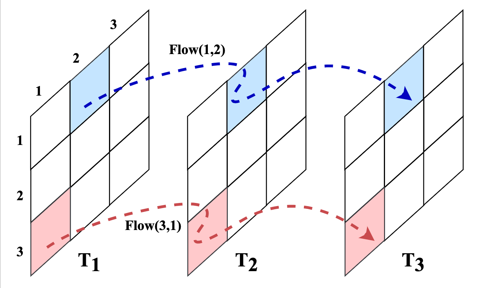
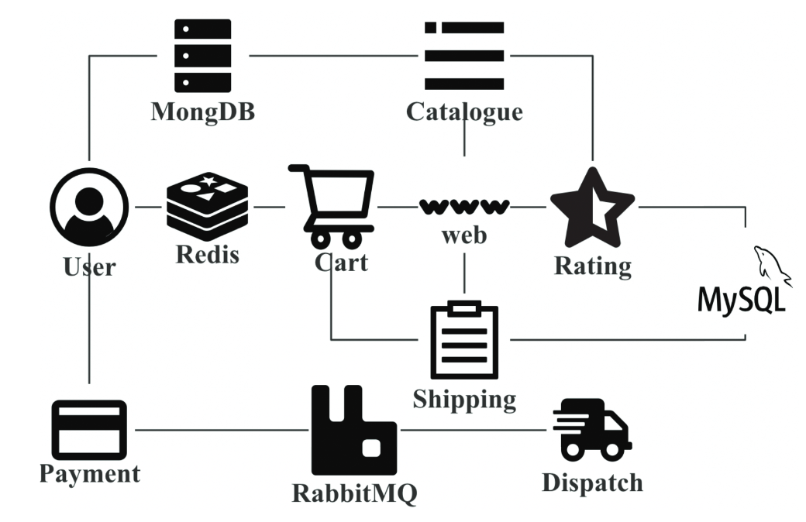
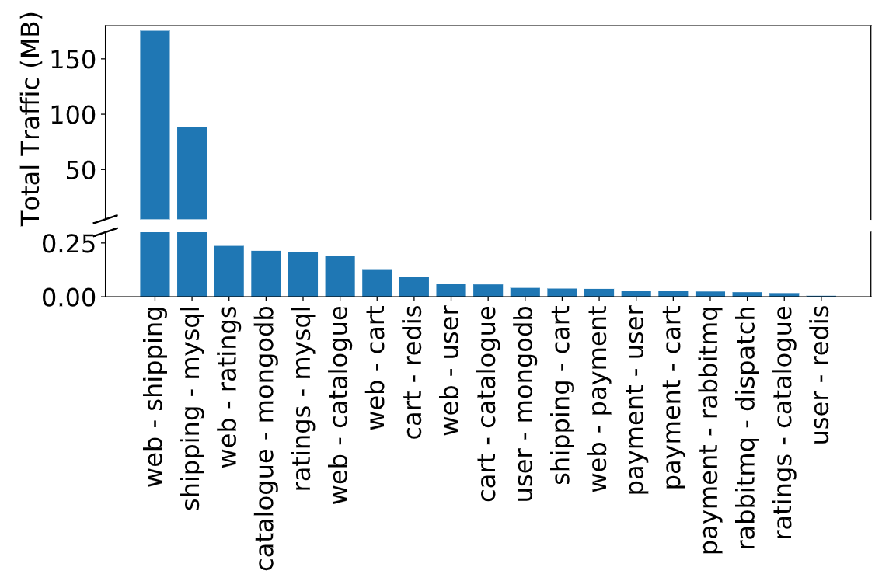

# Container-Traffic-Prediction

This is a basic container traffic predicition using ARIMA model.

Our TNSM paper will be published in IEEE soon.

Z. Wu, Y. Deng, H. Feng, G. Min and Z. Zhang. Blender: A Container Placement Strategy by
Leveraging Zipf-like Distribution within Containerized Data Centers. IEEE Transactions on
Network and Service Management. IEEE, Accepted.

## 1. Main idea
The main idea of predicting the traffic matrix is shown on below:

It depicts a scenario where two historical traffic matrixes (i.e., $T_1$ and $T_2$ ) are used to predict the next traffic matrix $T_3$. 

Each block in the traffic matrix indicates the total traffic volume between two containers. 

For example, $T_3(1,2)$ can be predicted by using $T_1(1,2)$ and $T_2(1,2)$ as training dataset with the ARIMA model. 

By analogy, other values in  can be predicted with the same approach. 

## 2. Data source
We collect this traffic trace from a public microservice ([robot-shop](https://github.com/instana/robot-shop)), where the communication architecture as follow:

## 3. Schema
| Field        | Comment                                |
|  ----        | ----                                   |
| timestamp    | time stamp                             |
| ip_src       | source IP of container                 |
| ip_dst       | destination IP of container            |
| traffic      | traffic volume gerenated by the IP pair|

## 4. Getting strated

- Run TrafficMatrixPrediction.ipynb with jupyter notebook

## 5. Data discussion

The file `traffic-composite_placements.csv` also represented the traffic between containers follows a Zipf-like distribution, which the disscusion is included in our paper (Section III).

The distribution as like as:

## 6. Checking result

- See pdf saved in `./images/`
